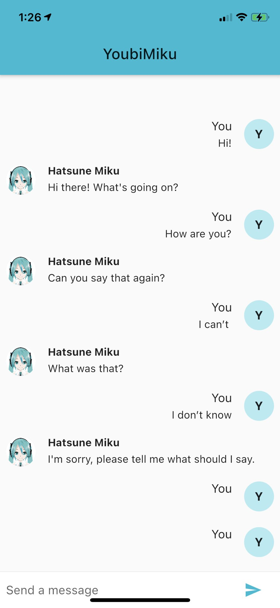

# youbimiku_flutter

Flutter version of [Youbimiku](https://github.com/aqua-ix/YoubiMiku/tree/master).

## Setup

Place the Dialogflow secret in `assets/dialogflow_secret.json`.

## Credit

This application features an adaptation of Hatsune Miku,  
© Crypton Future Media, Inc. 2007, licensed under a [CC BY-NC](http://creativecommons.org/licenses/by-nc/3.0/).
